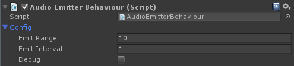

# Audio Emitter

The AudioEmitterBehaviour emits an audio audio source every "emit interval" seconds. These audio sources can be listened to using an  [Listener](http://devdog.nl/documentation/listener/). The Audio emitter behaviour creates an audio source which is pooled by the  [AudioSourceManager](http://devdog.nl/documentation/audio-source-manager/), which are set as children of the _Managers object.

.. raw:: html
	
	<iframe width="560" height="315" src="https://www.youtube.com/embed/2M5jJKCYNkE" frameborder="0" allow="autoplay; encrypted-media" allowfullscreen></iframe>

Also see  [Audio sources](), and see how you can create your own through code.