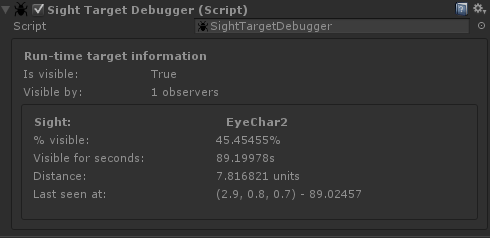

# Sight Target Debugger

The SightTargetDebugger can be used in combination with any  [ISightTarget](../Components/ISightTarget.md)  implementation; This includes the  [SightTargetBehaviour](../Components/SightTarget.md).

When playing inside the Unity editor the sight target debugger will visualize information about the target. All observers which can see this target will be displayed at the bottom, including the information about this target.

!!! note
	The SightTargetDebugger component will auto. be stripped when building your project and won't slow down your final builds. There's no need to remove the component when publishing your games.

