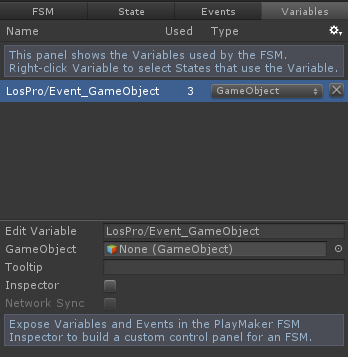
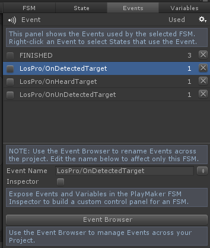

# Playmaker

<iframe width="560" height="315" src="https://www.youtube.com/embed/78vyHQZzeFE" frameborder="0" allow="autoplay; encrypted-media" allowfullscreen></iframe>

First, make sure the integration is enabled in the integrations wizard under Tools > Los Pro > Integrations. If you're using multiple Devdog assets that use an integration you will only need to enable it once. For example, if you're using Inventory Pro and Los Pro, and both use the integration PlayMaker, you'll only have to enable it once, and both assets will be able to use the integrations.

Click the integration you wish to enable, wait for Unity to recompile, and voila!

**Note: There's a bug in Unity 5.5+ that prevents the integration from enabling on the first try. You can reimport any script to recompile the code, or toggle the integration checkbox to re-compile the code and enable the integration.**

To get Los Pro's event in PlayMaker the events need to be bridged. This can be done by adding the Los to PlayMaker event bridge to a  [Sight target](../Components/SightTarget.md),  [Observer](../Components/Observer.md) or  [Listener](../Components/Listener.md).

## Using events

Events can be used to create them in the PlayMaker Events tab (see image).

When an event occurs the event gameObject (the gameObject that the event happened on) will be stored in "LosPro/Event_GameObject". This object can be created inside PlayMaker's editor's "Variables" tab. Make sure the type is "GameObject".

### Listener events

| Event name | Value stored in LosPro/Event_GameObject |
| --- | --- |
| LosPro/OnHeardTarget | Audio source emitter gameObject. |

### Observer Events

| Event name | Description | Value stored in LosPro/Event_GameObject |
| --- | --- | --- |
| LosPro/OnTargetDestroyed | A target to destroyed which was in range. You likely won't need this event. | (None) |
| LosPro/OnTryingToDetectTarget | A target is in range and in our field of view. Trying to detect the target. | The target we're trying to detect. |
| LosPro/OnDetectingTarget | A target is at least "min visibility" visible, as defined in the observer and is being detected. | The target we're detecting. |
| LosPro/OnDetectedTarget | A target got detected. | The detected target |
| LosPro/OnStopDetectingTarget | A target is no longer being detected. Note: This event is NOT called when a target becomes undetected. This event is only fired when OnDetectingTarget stops. | The target we've stopped detecting. |
| LosPro/OnUnDetectedTarget | A target has been undetected, either by going out of range or by being occluded. | The target that has been undetected. |
| LosPro/OnTargetWentOutOfRange | A target went out of range and is no longer detectable. | The target that went out of range. |
| LosPro/OnTargetCameIntoRange | A target came into range and is potentially detectable. | The target that came into range. |

### Sight Target Events

| Event name | Description | Value stored in LosPro/Event_GameObject |
| --- | --- | --- |
| LosPro/OnDetectedByObserver | The target got detected by an observer | The observer that detected this target. |
| LosPro/OnUnDetectedByObserver | The target got undetected by an observer. | The observer that undetected this target. |
| LosPro/OnCameIntoObserverRange | Came into an observer's range. | The observer |
| LosPro/OnWentOutOffObserverRange | Went out of an observer's range. | The observer |
| LosPro/OnObserverTryingToDetect | An observer is trying to detect this target. This means we're in range and in the FOV of an observer. | The observer |
| LosPro/OnGettingDetected | This target is getting detected by an observer. | The observer |
| LosPro/OnStopGettingDetected | This target is no longer getting detected by an observer. | The observer |