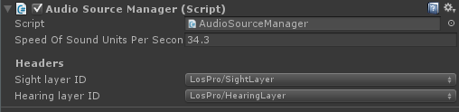

# Audio Source Manager

The AudioSourceManager and AudioSourceManager2D are the central control system of the audio system. Here you can configure the speed of sound, as well as the layers used for the sight triggers and audio source triggers.

-   **Speed of sound units per second:** The speed of the sound (expansion of triggers).
-   **Sight layer ID:** The layer used for the sight triggers. These are added automatically.
-   **Hearing layer ID:** The layer used for the audio spheres. These are added automatically.

